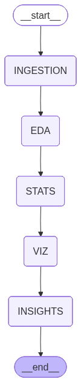

# 🚀 Autonomous Analytics Platform

An AI-powered **autonomous data analytics system** that performs end-to-end data analysis — from ingestion to insights — using a **multi-agent architecture**, interactive dashboard, and conversational interface.

---

## 🧠 Overview

This platform automates the complete data analysis pipeline:
Ingestion → Cleaning (HITL) → EDA → Statistics → Visualization → Insights → Chat


It combines **LLMs + data tools + UI** to create a **self-driven analytics system** with minimal human intervention.

---

## Architecture



## 🧠 Agent Roles

| Agent | Responsibility |
|------|---------------|
| Ingestion Agent | Loads dataset and initializes state |
| Cleaning  | Handles missing values (HITL) |
| EDA Agent | Generates descriptive statistics |
| Statistical Agent | Performs correlation, regression, tests |
| Visualization Agent | Creates charts using LLM planning |
| Insights Agent | Generates structured insights |
| Chat Agent | Handles user queries and routing |


## ✨ Key Features

### 📂 Data Ingestion
- Upload CSV datasets
- Automatic parsing using Pandas
- Error handling for invalid formats

---

### ⚠️ Smart Data Cleaning (HITL)
- Detects missing values automatically
- Triggers Human-in-the-Loop only when required
- Options:
  - Drop missing values
  - Fill missing values
  - Skip cleaning
- Auto-skips if dataset is already clean

---

### 📊 Exploratory Data Analysis (EDA)
- Descriptive statistics
- Key observations and patterns
- Data quality analysis:
  - Missing values
  - Invalid values
  - Outliers
- Clean UI (removes raw JSON and code)

---

### 📈 Statistical Analysis
- Correlation analysis
- Regression modeling
- Distribution metrics (mean, std, skew)
- Anomaly detection
- T-test evaluation

✔ Structured parsing for clean UI  
✔ Summary-first display for better UX  

---

### 📊 Visualizations
- Automatic chart generation
- Supported charts:
  - Histogram
  - Scatter plot
  - Bar chart
  - Box plot
  - Heatmap
- Adaptive visualization based on EDA and stats

---

### 💡 AI Insights
- Key insights
- Relationships between variables
- Anomaly explanations
- Actionable recommendations

✔ JSON → UI parsing  
✔ Categorized display:
- Key Insights
- Relationships
- Anomalies
- Recommendations  

---

### 💬 Chat with Your Data
- Natural language queries
- Context-aware responses using:
  - Dataset
  - EDA results
  - Statistical results
  - Insights
- Query routing:
  - Data queries → Pandas Agent
  - Insight queries → LLM
- History-aware conversations

---

### 🧠 Multi-Agent Architecture

Each stage is handled by a dedicated agent:

- Ingestion Agent  
- EDA Agent  
- Statistical Agent  
- Visualization Agent  
- Insights Agent  
- Chat Agent  

✔ Sequential pipeline execution  
✔ Modular and scalable design  

---

### 🎨 SaaS-Style Dashboard UI

- Clean vertical layout 
- Sections:
  - Overview (metrics)
  - Dataset preview
  - EDA
  - Statistical summary
  - Charts
  - Insights

---

### 🧪 Testing (Pytest)

✔ 10+ Unit Tests  
✔ 3+ Integration Tests  

Covers:
- Ingestion
- Cleaning
- Chat agent
- Router logic
- Visualization agent

---

### 🔍 LangSmith Integration

- Trace agent execution
- Debug LLM calls
- Improve observability

### Project Structure

```text
AUTONOMOUS-ANALYTICS/
│
├── agents/
│   ├── ingestion_agent.py
│   ├── eda_agent.py
│   ├── stats_agent.py
│   ├── visualization_agent.py
│   ├── insights_agent.py
│   └── chat_agent.py
│
├── tools/
│   ├── cleaning.py
│   ├── eda_tools.py
│   ├── stats_tools.py
│   ├── data_loader.py
│   ├── visualization_tools.py
│   └── insights_tools.py
│
├── graph/
│   ├── builder.py
│   ├── hitl.py
│   └── nodes.py
│
├── core/
│   ├── config.py
│   └── state.py
│
├── ui/
│   ├── components/
│        ├── charts_view.py
│        ├── eda_view.py
│        ├── hitl.py
│        ├── insights_view.py
│        ├── metrics.py
│        ├── preview.py
│        ├── sidebar.py
│        └── stats_view.py
│    ├── pages/
│        ├── chat.py
│        └── dashboard.py
│
├── tests/
│   ├── unit/
│   ├── integration/
│   └──conftest.py
│
├── main.py
├── requirements.txt
└── README.md
```
---

# Installation

---

# 1. Clone Repository

```bash
git clone <repository_url>
cd AUTONOMOUS-ANALYTICS
```

---

# 2. Create Virtual Environment

## Linux / Mac

```bash
python -m venv .venv
source .venv/bin/activate
```

## Windows

```bash
python -m venv .venv
.venv\Scripts\activate
```

---

# 3. Install Dependencies

```bash
pip install -r requirements.txt
```

---

# 4. Environment Variables

Create:

```text
.env
```

Add:

```env
GROQ_API_KEY=your_groq_api_key
```

---

# Running the Application

```bash
streamlit run main.py
```

---

# Testing

---

# Run All Tests

```bash
pytest
```

---

# Run Verbose Tests

```bash
pytest -v
```

---

# Run Coverage

```bash
pytest --cov=.
```

---

### 🛠️ Tech Stack
- Frontend: Streamlit
- LLM Framework: LangChain Langgraph
- Data Processing: Pandas
- Visualization: Plotly
- Testing: Pytest
- Observability: LangSmith

### ⚠️ Limitations
- Large datasets may impact performance
- LLM outputs may vary slightly
- Limited time-series intelligence
- Requires structured datasets

### 📄 License

- This project is for learning and research purposes.